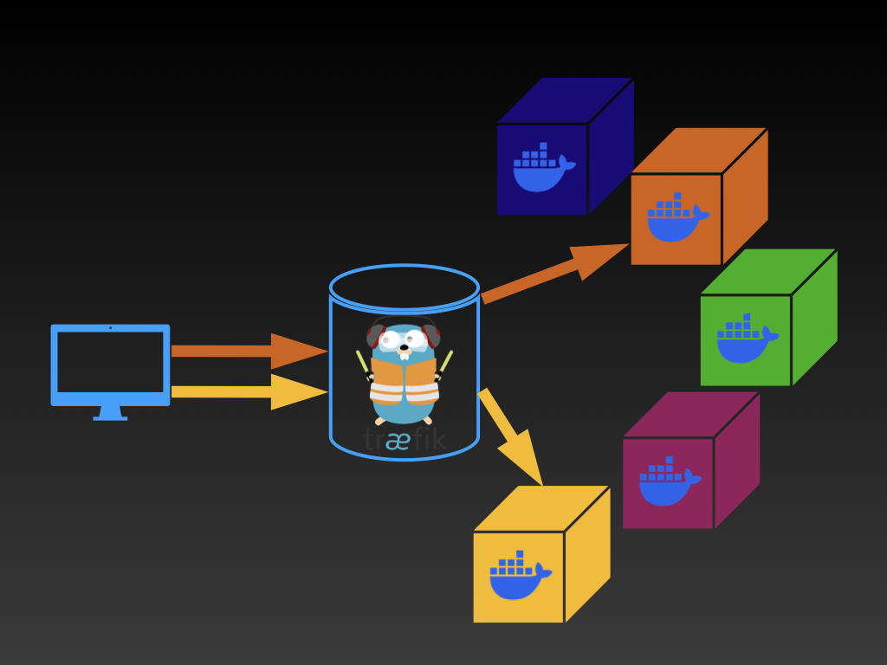
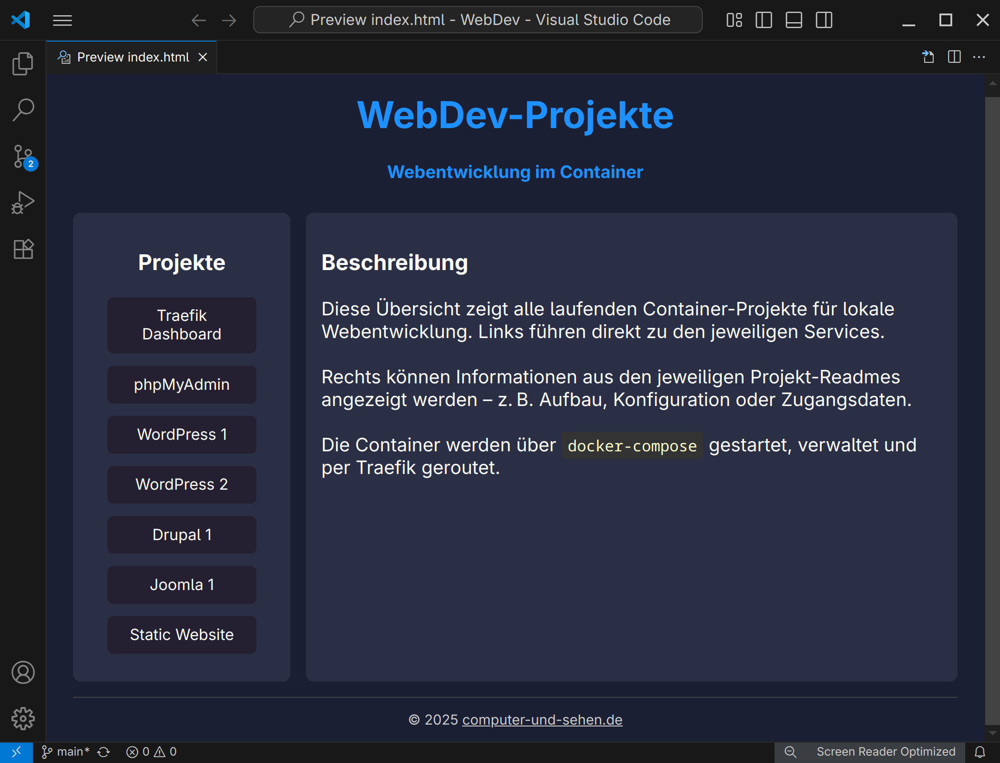

# WebDev: Lokale Entwicklungsumgebung mit Docker & Traefik

Diese Sammlung enthält mehrere Webprojekte (CMS, Tools) für lokale Tests oder als Lernumgebung für die Webentwicklung, orchestriert mit Docker Compose und Traefik als Reverse Proxy.




## Enthaltene Dienste

| Projekt      | Adresse                 | Beschreibung         |
|--------------|--------------------------|-----------------------|
| WordPress 1  | http://wp1.localhost     | WP-Instanz mit MariaDB |
| WordPress 2  | http://wp2.localhost     | WP-Instanz mit MariaDB | 
| Drupal 1     | http://drupal1.localhost | Drupal mit PostgreSQL  |
| Joomla 1     | http://joomla1.localhost | Joomla mit MySQL       |
| Statische Website | http://site.localhost | HTML und CSS
| phpMyAdmin   | http://pma.localhost     | DB-Verwaltung          |
| Traefik      | http://localhost:8080    | Traefik Dashboard      |
| Startseite   | http://start.localhost   | Landingpage zu allen Projekten |

## Container

Die einzelnen Instanzen werden mit Docker-Compose erstellt. Alle Container laufen im selben externen Netzwerk ` webdev-net` . Die Services werden über Traefik verwaltet, der Zugriff erfolgt über ` *.localhost`. 

Zudem ermöglicht eine Landing-Page den einfachen Aufruf der einzelnen Projekte.

 


## Starten und Stoppen

Alle Container können gemeinsam per Skript gestartet oder beendet werden:

```bash
sudo bash start-all.sh   # Alle Container starten
sudo bash stop-all.sh    # Alle Container stoppen
```
